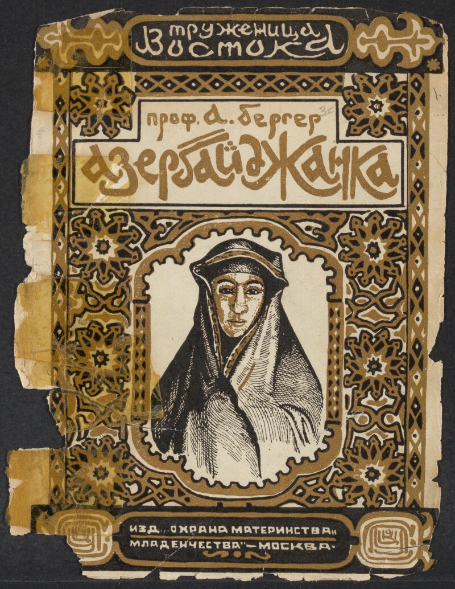

# The Female Worker of the East #

## About the project:

This Digital Humanities Certificate project is called "The Female Worker of the East" (trans. from Russian - “Труженица Востока”). The project shares its title with the publication it is based on, a short periodical published between 1927 – 1929 in the Russian language. There are several terms used to describe these prints, mostly brochures and pamphlets - I will use brochure going forward. Each brochure consists of 30-50 pages of text, drawings and photographs, describing the livelihoods of women from thirty ethnic groups living across Soviet geography. The title signals to how Soviet ethnographers, who compiled the brochures, conceptualized the idea of the inner “East”. The geographic perimeters of the inner East in Soviet imagination extended from Caucasus to Central Asia, Siberia, Transbaikalia, Amur region, Kamchatka and Chukotka, described Natalya Chernyaeva, who writes extensively about various works of early Soviet ethnographers. 

At first glance, I noticed a descriptive, structural and marketing uniformity among the brochures. For one, the ethnic groups within each respective brochure appear to have been described as backwards, particularly the women. Structurally, all thirty have the same number of chapters, following the same narrative structure, which starts with an overview of the environment each community inhabits, followed by observations on the roles of women in the community as whole and in the family, finalized by developments brought to these communities after the revolution. From the marketing standpoint, all had the circulation of 7000 copies, with prices ranging between 18-22 cents (trans. from Russian копеек). Considering such a limited scope and the Russian being the language of the publication, it is reasonable to assume that the intended public for them were educated elite, and institutional settings, such as libraries and universities. 

However, I decided to take a closer look at these historical documents to try to unearth what their authors might have hidden on the plain sight. For this interrogation I decided to utilize topic modeling using spaCy, a natural language processing (NLP) model which using Python to operate. For my research I identified the following **questions**: 

- What are the main topics that are shared among brochures? Do they mach to the results of the close reading? 

- How are the Muslim women, who represent 13 out of 30 ethnic groups accounted for in the brochures, are described in comparison to their non-Muslim counterparts? How does the topic modeling demonstrate these discrepancies? Are there any discrepancies that came up in the topic modeling outputs?

- What is the role of stop words in this project? How to make decisions on what words to keep and what to remove in the pre-processing? How do these decisions impact the topic modeling output?

- Considering that topic modeling is designed to analyze representative or thematic samples of large data sets, what are be the benefits of utilizing it with a small corpus? 

Overall, I argue that "The Female Worker of the East" presents a complex and multifaceted perspective on Muslim women which needs a careful and close examination. Even thought this complexity may not be visible in the topic modeling outputs, small size print media like this one, can serve as a starting points for intriguing research questions that guide the work of other researchers. Based on the research questions, I expect the audience of this project to be researchers of the Soviet gender and minority histories and digital humanists interested in using topic modeling as a primary analytical tool. 

## How to engage with the project? ##

* [Analysis and findings](https://github.com/sayyarahuseynli/workeroftheeast.github.io/tree/main/analysis_and_findings)

* [Primary source](https://github.com/sayyarahuseynli/workeroftheeast.github.io/tree/main/primary_source)
  
* [Technical tools](https://github.com/sayyarahuseynli/workeroftheeast.github.io/tree/main/Technical%20tools)

* [Visualizations](https://github.com/sayyarahuseynli/workeroftheeast.github.io/tree/main/visualizations)

* [Acknowledgements](https://github.com/sayyarahuseynli/workeroftheeast.github.io/wiki/Acknowledgment#who-made-the-project-possible)

## Useful links ##

In English:

[Russian Corpora](https://ruscorpora.ru/en) 

[Topic Modeling Russian History](https://link.springer.com/chapter/10.1007/978-3-030-42855-6_24#Sec9)

[Meet the Method: Computational Text Analysis](https://cssh.northeastern.edu/nulab/meet-the-method-computational-text-analysis/)  

In Russian:

[Chernyaeva N. Imagining the Soviet East: Narratives of Popular Ethnography in a Series of Pamphlets, The Female Worker of the East, 1927–1929. Etnografia. 2022. 3 (17): 149–178. (In Russ.). doi 10.31250/2618-8600-2022-3 (17)-149-178](https://etnografia.kunstkamera.ru/en/archive/2022_issue_3_17/chernyaeva_n_imagining_the_soviet_east_narratives_of_popular_ethnography_in_a_series_of_pamphletsthe_female_worker_of_the_east_1) 

