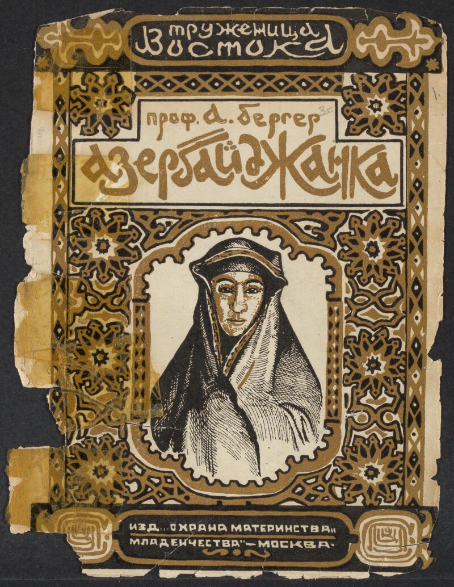

# The Female Worker of the East

* [Stopwords](https://github.com/sayyarahuseynli/workeroftheeast.github.io/tree/main/Stopwords)
- [Primary source](https://github.com/sayyarahuseynli/workeroftheeast.github.io/tree/main/Primary%20source)
* [Technical tools](https://github.com/sayyarahuseynli/workeroftheeast.github.io/tree/main/Technical%20tools)

About the project
“Ethnic Women in Soviet Space” is a repository showcasing the official portrayal of women from thirty ethnic groups within the Soviet Union. The information about these women was published in “Труженица Востока” ("Truzhenit︠s︡a Vostoka") journal between 1928-20. I use [topic modeling](https://programminghistorian.org/en/lessons/topic-modeling-and-mallet#what-is-topic-modeling-and-for-whom-is-this-useful) to identify how the propoganda language in this early Soviet publication, intentionally posits indigenous women as oppressed, patrionized and victims of the previous regime. Although the Soviet system's goal here is depicted as emancipatory, the real goal of the system in liberating women was to ensure provision of labor forces to support the rapid industrilization process and propel the economic progress.     

**Research questions**

- Diversify our understanding of Muslim women’s occupations in late Imperial Russian and early Soviet History by using topic modeling tool, Mallet
  
- Pose critical research questions based on the results generated through topic modeling
  
- Document the implementation process of working with Russian language in a topic modeling Mallet, especially the stopwords

**About the primary source**

>The Female Worker of the East,published in the USSR from 1927 to 1929, as an example of popular ethnography from this period, i.e., ethnographic knowledge communicated via non-specialized texts for a broad audience. Created by ethnographers affiliated with the Scientific Association of Oriental Studies, the pamphlets used the language of description that drew both on Russian academic ethnography of the Imperial period and the Marxist ideological canonfile. Quote from this article. [Read more here](https://cyberleninka.ru/article/n/voobrazhaya-sovetskiy-vostok-narrativy-populyarnoy-etnografii-v-serii-broshyur-truzhenitsa-vostoka-1927-1929/viewer) 

For the pre-preprocessing of the corpora, I extracted the text from each brochure into a seperate Google Docs file which I subsequently saved in txt format. I tracked this process in a Google Sheet [file](https://docs.google.com/spreadsheets/d/1WJqD3pefQvqm_7P4_fsjvtYJ_cCSSoVbIeO1uvRs0uo/edit?gid=0#gid=0). Another preparatory step was to split each file of the previously created files into sections of less than 1000 words, based on the context. This means that no sentences were split or deconstructed during the splitting process. You can see the splitting in this sample [file](https://docs.google.com/document/d/1tThhBmCiCsHAyF5pnhE9Sv-0Tci44ADkB0q_09MA4lQ/edit?tab=t.0) where the highlighted areas demonstrate where and at what word count I cut the text. The number next to parentheses corresponds with the numerically named subsection. Once the splitting was done, I saved each of the [sections](https://drive.google.com/drive/folders/1Hp3Uakgziklr1MQMSR1iq4sIr2kJy80s?usp=drive_link), originally Google Docs, as txt files. 

One contextual category embedded in the tracking file above is the religious diversity represented in the brochures. Over 50% of ethnic groups are Muslim, however, Christian, Shamanism, Confucianism, Paganism, and Laism are also made visible. As the brochures were constructed by ethnographers and anroropologists, the text also provide interesting desriptions of local traditions and beliefs.    

**Method and its limitations**

**Lessons learned and Opportunities**

**Teaching resources**

In Enligsh:

[Russian Corpora](https://ruscorpora.ru/en) 

[Topic Modeling Russian History](https://link.springer.com/chapter/10.1007/978-3-030-42855-6_24#Sec9)

[Meet the Method: Computational Text Analysis](https://cssh.northeastern.edu/nulab/meet-the-method-computational-text-analysis/)  

In Russian:

