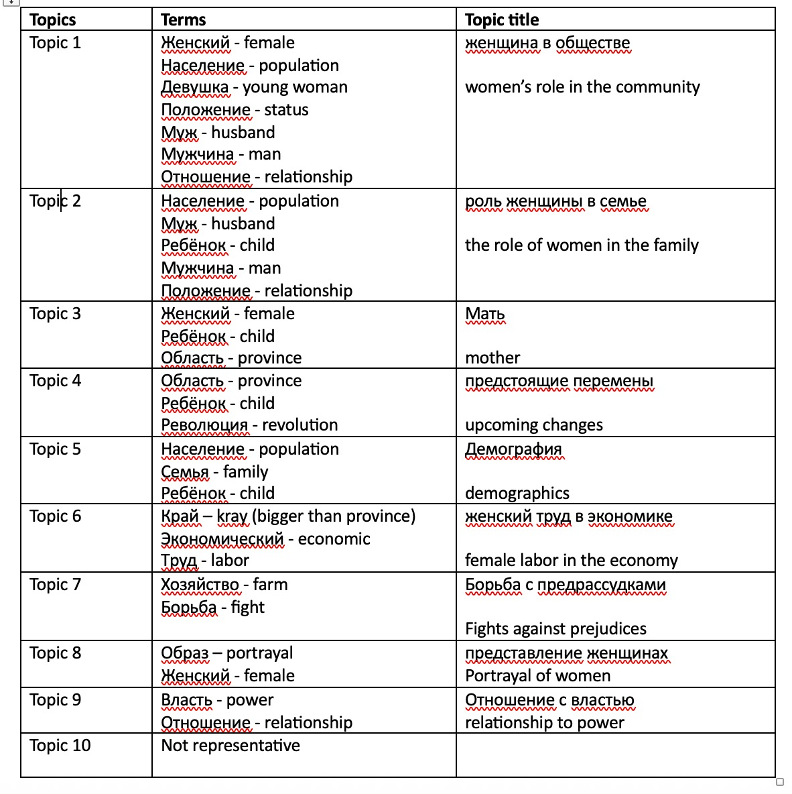

## Findings using 10 topics ##

The first table shows most representative and unique terms across 9 topics. First, I included terms that uniquely appeared in each topic in the Terms column. Then, I recorded the subjective topic titles for each set of terms in the third column. 

The most common topics according to this table are women’s role in community and family. The appearance of these topics was an expected outcome of topic modeling: the sequence of their presence follows the organizational structure of the brochures. Similarly, Topic 3 demonstrates that one of the main roles of women within their respective societies was bearing children, another expected outcome.

The first interesting term that prompted me to investigate further was "position". Close reading of the original texts using this term reveals peculiar findings. 

Finding 1. 
>"Положение черкешенки до Октябрьской революции. Вся жизнь черкешенки до революции была обставлена рядом стеснительных обычаев, часто совершенно варварских по характеру."

Translation: 
>"The position of a Circassian woman before the October Revolution. The entire life of a Circassian woman before the revolution was surrounded by a myriad of <u>embarrassing</u> customs, often completely <u>barbaric</u> in nature.” – “Cherkeshenka” brochure, p. 14

Finding 2. 
>“Целый ряд стеснительных правил закреплял это положение. «Женщина не должна громко петь в присутствии посторонних мужчин. Молодые женщины должны говорить мало, вполголоса, не смеяться громко”.

Translation: 
>“A whole series of <u>embarrassing</u> customs reinforce this position. A woman should not sing loudly in the presence of strange men. Young brides should speak little, in a low voice, and not laugh loudly.” “ЯКУТКА” brochure, p. 23

Looking at the context in which the word “position” is used in each case, reveals a different circumstance. Often in the first two chapters, it is used to illustrate the oppressiveness of women’s position, using specific examples drawn from traditional practices. Adjectives associated with those traditions, such as “barbaric” and “embarrassing”, clearly transmit the judgement of the authors. This finding is one of the many examples of how the ethnographers who authored the brochure created narratives justifying the civilizing mission of the Soviet regime, which was aimed at freeing women of the East from their pre-revolutionary misery. 

In some instances, the term “position” describes the status and credibility of other local authorities, like religious ulama or traditional healers. In rare instances, the authors highlight a positive pre-revolutionary status of women, like in the Votak brochure shown in Example 3.  Nevertheless, the excerpt from the Votak brochure is an excellent support for Chernyaeva’s assertion that authors exaggerated and, at times, fabricated some characteristics of the “ethnic backwardness” to dramatize the pre- and post-revolutionary impact of the regime. 

Example 3: 
>“Не в пример женщинам соседних народностей, вотячка и некоторых отношениях пользовалась и до революции большой свободой…Но, на ряду с этим, в ее быте есть много отрицательного...” 

Translation: “Unlike women of neighboring ethnicities, the Votyak woman enjoyed great freedoms even before the revolution... But, along with this, there were many negative aspects in her everyday life…” “Votachka” brochure, p. 17

Comparatively, Topic 6 signals to the presence of discussions about the economy of labor, which is an ambiguous theme. To understand the meaning of it, I close read the texts and concluded that two types of economies have been described in the brochures: one, the primary income generating occupation within each community, and two, the economic dependency of women on their husbands.

## Findings using 30 topics ##