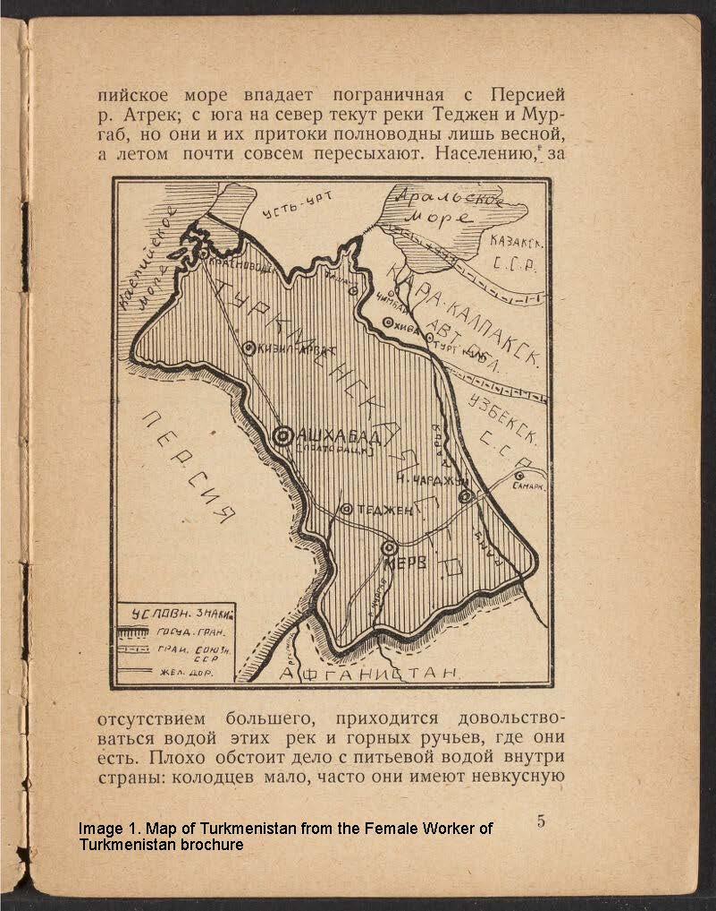
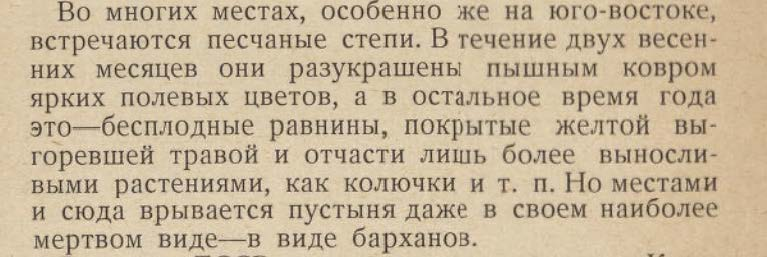
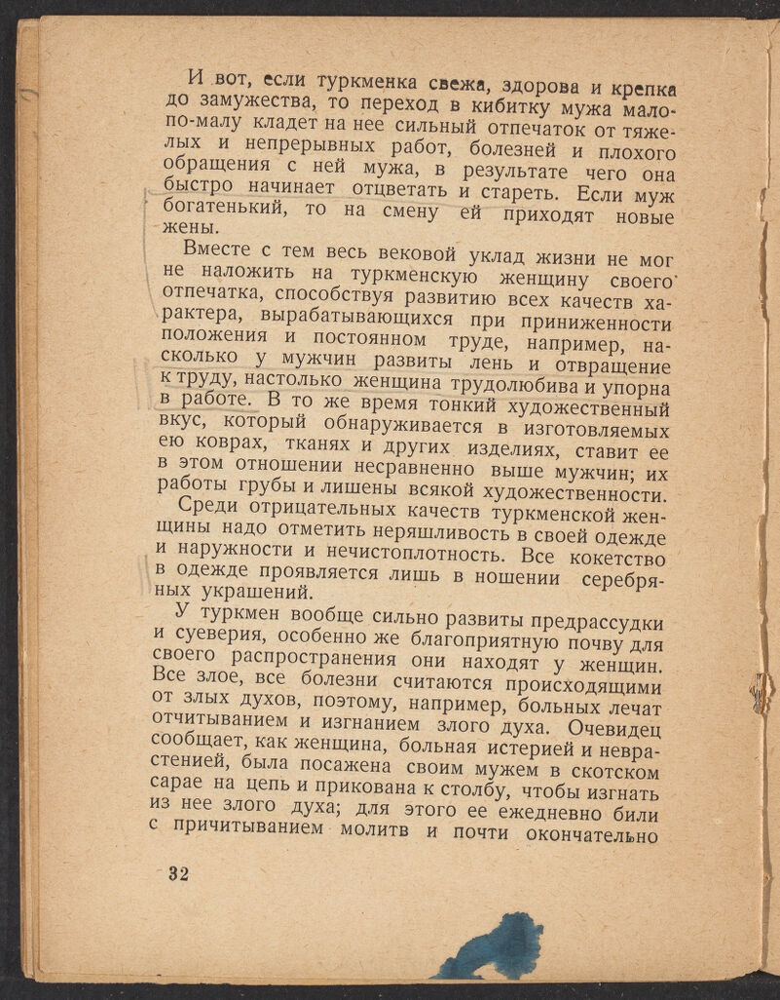
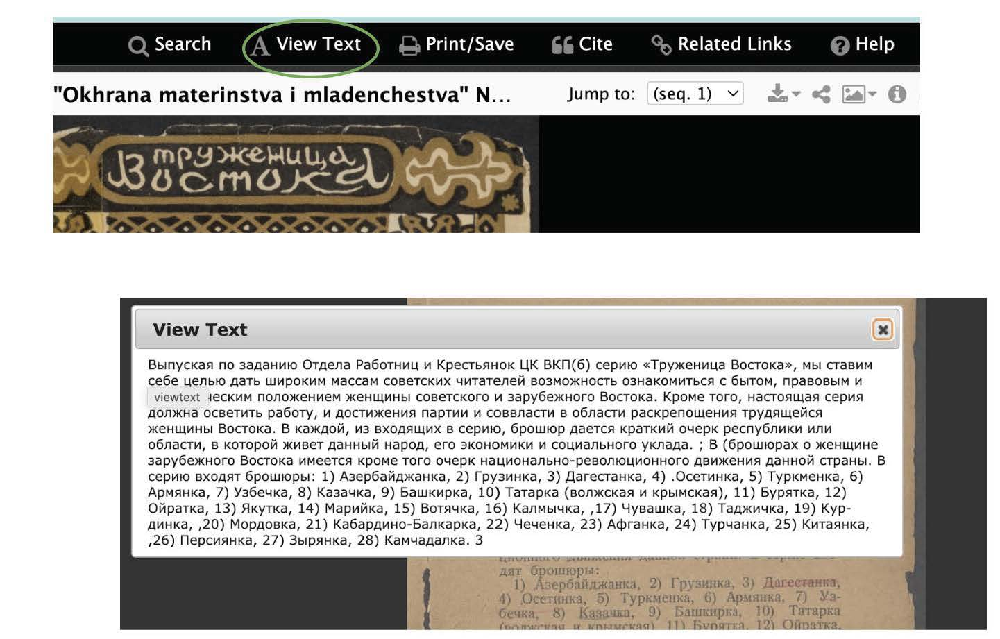

The Female Worker of the East, “Tруженица Востока” in Russian, brochure is published in the USSR between 1927 and 1929, is as an example of popular ethnography from this period. Here the ethnographic knowledge is communicated via non-specialized texts describing the diversity of communities living under the umbrella of the union written for the consumption of a broad audience. Created by ethnographers affiliated with the Scientific Association of Oriental Studies, the brochures use the language of description that draws both on Russian academic ethnography of the Imperial period and the Marxist ideological canonfile. 

Natalia Chernyaeva, a researcher who specializes in the history of parenting and motherhood in Imperial and Soviet Russia, [says](https://www.academia.edu/102573955/Chernyaeva_Imagining_the_Soviet_East_Narratives_of_Popular_Ethnography_in_a_Series_of_Pamphlets_The_Female_Worker_of_the_East_1927_1929) that these pamphlets are not regular examples of Soviet propaganda. There are three distinct features of this publication that set it apart from other propaganda materials. Dr. Chernyaeva pointed out that the publication has been authored by cultural professionals, such as anthropologists and ethnographers, rather than members Bolshevik party. The evidence of cultural authorship are photos, maps, descriptions of cultural traditions such as marriages, household behaviors, and lifestyles. 

Image 1. 

The second feature is the inclusion of narratives describing the local ecology and landscape. The descriptions of the temperature changes, flora and fauna, and natural resources help the readers imagine the regions of the country they would have never had the change to visit, due to limited financial resources and lack of transportation infrastructure.

Image 2. . 

>Translation of the paragraph 2, sentence 1: _“Sand steppes are common in many places, especially in south-east. During two spring months, these landscapes get coated with a lush cover of field flowers, while the rest of the year when these plains are barren, covered with yellow with sunburned grass and more durable thorn plants. Unfortunately, the desert with finds its way to these regions too, with its deadly appearance of dunes.”_ p. 4

The third, and most interesting feature for me, are the sections about women’s artistic and cultural productions. Such desriptions explain the specific focus on women populations, as they are depicted as oppressed but hard working and resilient individuals. 
For this reason, in the topic modeling, I pay close attention to the appearance of words associated with forms of women's cultural production, such as textile, household object, and carpets. The excerpt on next picture illusrates an example of such mentions. 

Image 3. 

>Translation of the paragraph 2, sentence 2. _“Her subtle artistic taste illustrated on the handmade carpets, textiles, and other objects, raise her above men, whose works are devoid of any artistic expression. 2nd sentence in the 2nd paragraph"_. p.32
  
The corpus for the current project is located on Harvard Hollis Library [website,](https://hollis.harvard.edu/primo-explore/fulldisplay?docid=01HVD_ALMA212293267000003941&context=L&vid=HVD2&lang=en_US&search_scope=everything&adaptor=Local%20Search%20Engine&tab=everything&query=lsr01,contains,99153757497003941&mode=basic&offset=0) where each of the thirty issues of the publication can be downloaded as separate PDFs. The access to the files on the page is open, allowing individuals outside of Harvard to view and download the material. Initially, I tried to find OCR tools to convert the PDFs into text, which proved to be tedious due to the excessive number of unrecognized characters that appeared during the translation process. Luckily, I discovered an embedded option on the Viewer page, called View Text, which makes the text on the image from PDF appear as simple text without using a third-party software. 

Image 4. 

The result of this discovery was the next step of pre-processing, which is the extraction of the texts into separate Google Doc documents. The reason for using Google Doc instead of TextEdit, a Mac software for simple text files, was the ease of formatting and cleaning the data. The extraction of this text only included a copy+paste command from the View Text window into the Google Doc file, which is not the most fun process. Given each document consisted between 35-50 pages, this step of data collection took me more time than I would like to admit. After establishing the files with raw text, I saved each Google Doc file AS .txt. ЯКУТКА_Simple Text -> ЯКУТКА_Simple Text.txt. As a result of this process, I have two copies of each of the thirty files, one that is a Google Doc and one .txt.

