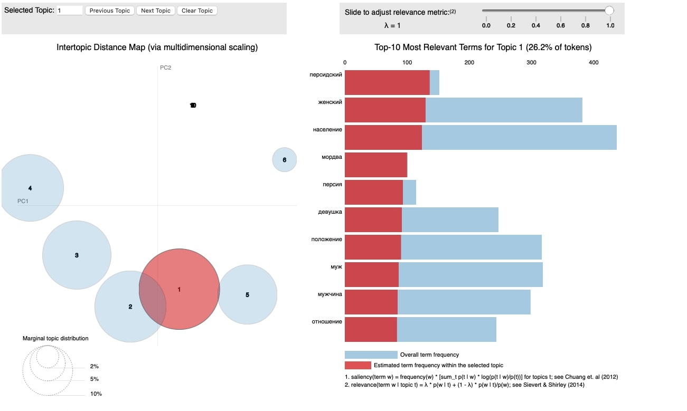

## About the visuals ##

The visuals included in the current folder contain the outputs of Topic Modeling with Python using spaCy and Gensim. The visualization aspect was possible with the help of pyLDAvis, which is the last action performed in the topic modeling code.

### File naming convention ###

The generated file names follow the naming convention: topicVis + the number of topics portrayed in that visual + .html. If I change variables, such as the number of columns appearing on the right side of the visual, and run the code again with the same number of topics, the original file will be overwritten with the same name. To preserve the original file, I add an underscore (_) and the number of topics to the end of the file name.

# Topic modeling analysis #

One of the most important decisions that needs to be made before conducting a topic modeling analysis is to decide an optimal number of topics. Most researchers suggest experimenting with different numbers to evaluate the quality of topic outputs. On one hand, analyzing larger data sets with a low number of topics can result in topics that are too general, missing out on the granularity of the data. On the other hand, using too many topics will generate outputs with topics that are too rare and non-representative. 

For the current analysis, I experimented with 10, 30, 50 and 100 topics. The outputs generated using 10 and 30 topics were more interesting than those of 50 and 100. For this reason, the below analysis will include excerpts from using 10 and 30 topics. 

## How to interact with the visuals? ## 
All visuals included in the current folder are interactive. However, due to technical difficulty of embedding these visuals directly on GitHub, I opted to include static screenshots followed by URLs. By clicking the URLs, the user of the project can engage with the visual directly. 

### Suggested actions for interactivity: ###

- Use the top left “Selected Topic” box to view topics clustered together. 
  * For example, in the 10-topic visual, only 6 topics are visible on the left chart, whereas topics 7-10 are clustered together under the number 10, formatted in bold. To view topic 8, type that number in the “Selected Topic” box, which makes the terms of that topic appear on the right side of the screen. 
- Use “Slide to adjust relevance metric:” to view terms within that topic from most common to least common.
  * 1.0 represents the most relevant terms in that topic
  * 0.0 represents the least relevant terms in that topic, ie. Terns that may have appeared only in one or two documents
- The circles represent topics while the sizes correlate with their commonality 
- The space between the circles shows the similarity of topics

