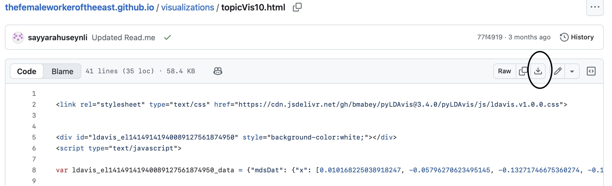

## About the visuals ##

The visuals included in the current folder contain the outputs of Topic Modeling generated using Python together with spaCy. The specific tool that made the visuals possible was [pyLDAvis](https://pypi.org/project/pyLDAvis/), the tool of Python library designed to create interactive visualizations.

### File naming convention ###

The generated file names follow the naming convention: topicVis + the number of topics portrayed in that visual + .html. If I changed any variables, such as the number of columns, and ran the topic model code without changing the file name, the file that was generated first would be overwritten. To preserve the results of my numerous experiments, I made sure to change the file name every time. I added an underscore (_) and the identified the number of topics applicable for that run, which is reflected at the end of the file name.

## How to view with the visuals? ## 
To view the file, navigate to the file in the Visualizations folder, select one of the HTML files, and click on it. You will see the raw file on your page, that's all right. Bring your cursor to the third button at the top right side of the page, which will be Download raw file. Having downloaded it on your devide, open the file using your favorite browser and explore. See the image below: 

### How to interact with the visuals? ###
All visuals included in the current folder are interactive. However, due to technical difficulty of embedding these visuals directly on GitHub, I opted to include static screenshots followed by URLs. By clicking the URLs, the user of the project can engage with the visual directly. 

### Suggested actions: ###

Please note: The circles represent topics while the sizes correlate with their commonality. The space between the circles shows the similarity of topics.

- Use the top left “Selected Topic” box to view topics clustered together. 
  * For example, in the 10-topic visual, only 6 topics are visible on the left chart, whereas topics 7-10 are clustered together under the number 10, formatted in bold. To view topic 8, type that number in the “Selected Topic” box, which makes the terms of that topic appear on the right side of the screen. 
- Use “Slide to adjust relevance metric:” to view terms within that topic from most common to least common.
  * 1.0 represents the most relevant terms in that topic
  * 0.0 represents the least relevant terms in that topic, ie. terms that may have appeared only in one or two documents

* Disclaimer: I haven't found a way to embed the HTML files into GitHub. This is the reason I guide my readers to download the files on their computers for viewing. Hopefully, this is a temporary solution. In the meantime, I appreciate your patience, my dear reader.